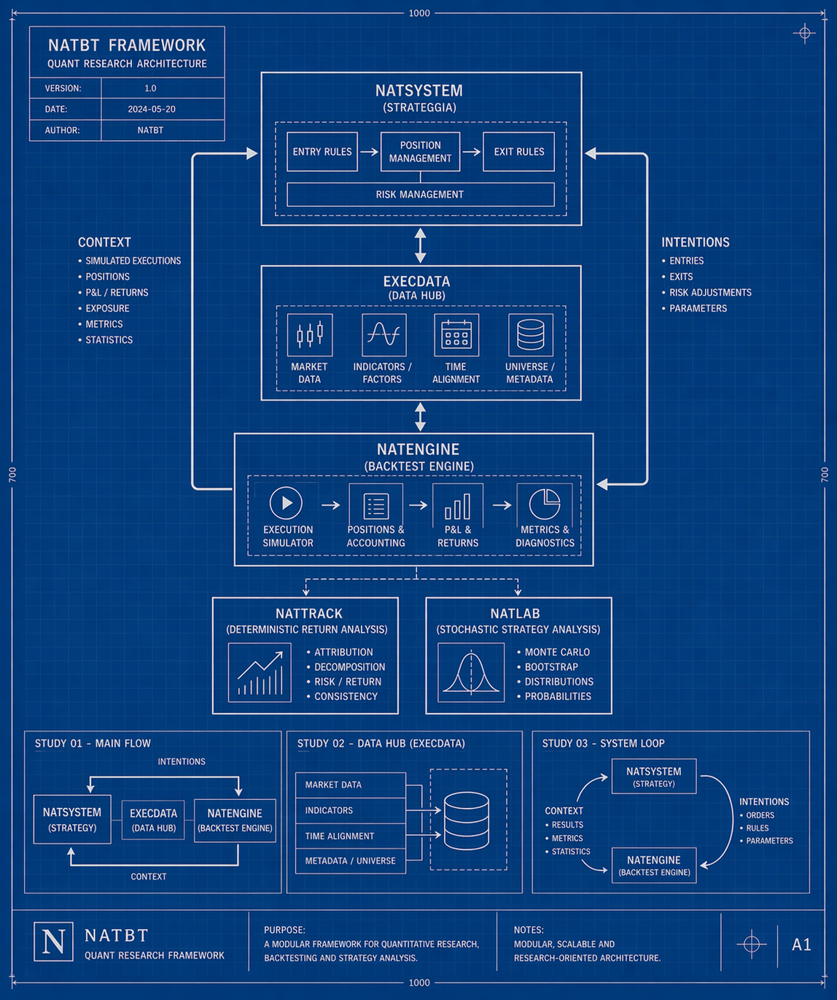
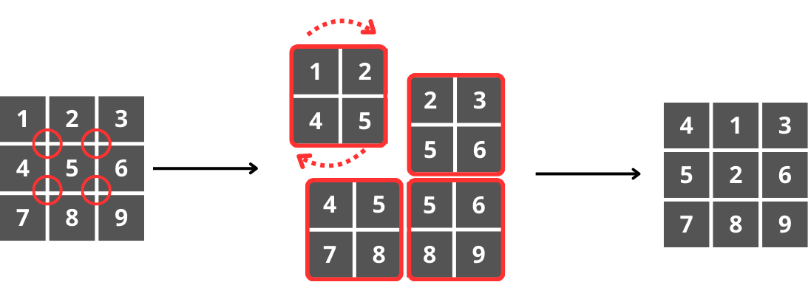
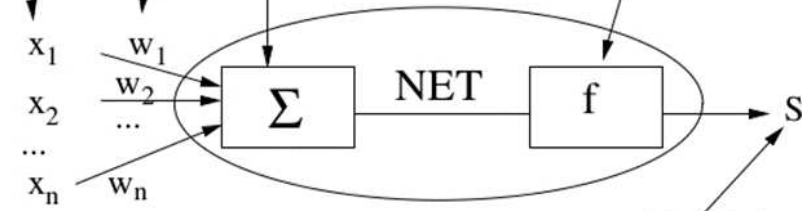
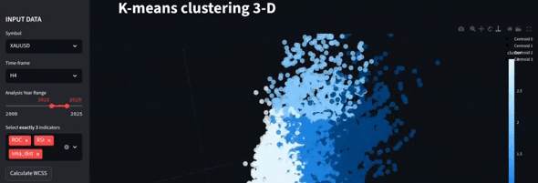
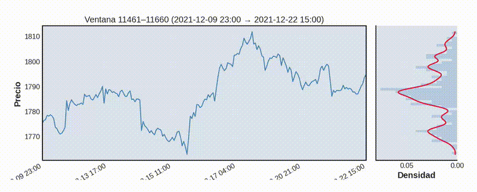
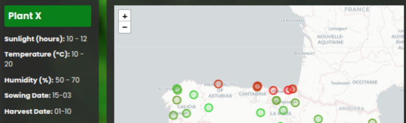
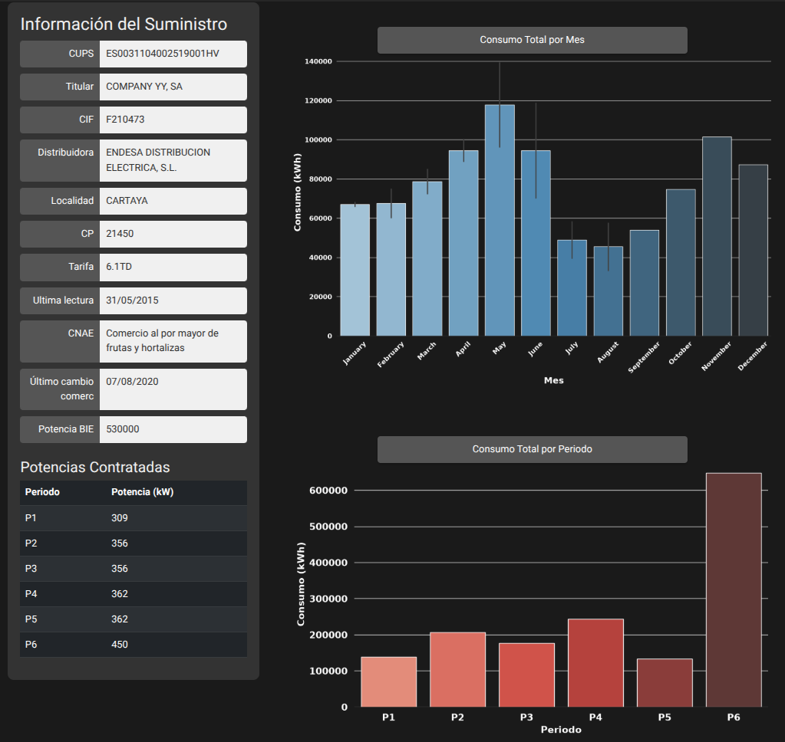

# 𝄃𝄃𝄂𝄂𝄀𝄁𝄃𝄂𝄂𝄃 **Raul**

  

**Computer Science student** with a strong interest in **mathematics, algorithms and systems**, with a practical background in **Python, Machine Learning and quantitative research** and a growing focus on **C++ and embedded systems**.
I enjoy understanding how things work under the hood and building things from first principles as a way to understand the theory behind them.

---

## About me

I’m currently studying **Computer Science**, driven mainly by curiosity and a genuine interest in the **fundamentals behind software, algorithms and computational systems**.

What motivates me the most is not a specific domain, but the **process of reasoning**:
**modeling problems**, understanding **constraints**, designing **algorithms** and translating ideas into working systems.

Most of my previous hands-on work has been developed in **Python**, particularly around **algorithms, Machine Learning, statistics and quantitative research**. This includes implementing algorithms from scratch and developing larger projects such as my own **backtesting and stochastic analysis framework**.

More recently, my focus has been shifting toward **C++ and lower-level development**, with a particular interest in understanding memory, performance, hardware interaction and the software foundations behind embedded and real-time systems.

---

## Current focus

I am currently focusing my studies and personal projects on:

* **C++**
* **Algorithms and data structures**
* **Memory and resource management**
* **Mathematical software**
* **Embedded systems**
* **Computer architecture and hardware/software interaction**

As part of this transition, I am currently implementing parts of the **C++ STL from scratch**, developing my own **C++ mathematical library**, and progressively working toward a **flight controller for a custom quadcopter based on an ESP32-S3**.

My long-term goal is to combine **embedded systems, Computer Vision and Machine Learning** in autonomous systems, particularly **robotics and UAVs**.

---

## Background

Most of my practical work revolved around **Python, algorithms, data structures, Machine Learning, statistics and quantitative research**.

Some of the areas I have explored include:

* Implementing **Machine Learning algorithms from scratch**
* Neural networks and backpropagation
* Clustering and unsupervised learning
* Graph search algorithms
* Probability and statistical modeling
* Financial time-series analysis
* Backtesting and stochastic evaluation
* Data analysis and visualization

Rather than seeing this as a separate direction, I see it as the **mathematical and algorithmic foundation** I want to bring into the systems I build in the future.

---

## **MAIN PROJECTS**

### **NatBT — Quantitative Research & Backtesting Framework**

**[Repository](https://github.com/srrvno/NatBT)**

A Python framework developed for **strategy backtesting and deterministic/stochastic evaluation of trading systems**, built around per-trade returns and a clear separation between trade generation and statistical analysis.

It includes a custom backtesting engine, deterministic performance and risk analysis, **block-bootstrap Monte Carlo simulation**, parameter optimization and experimental walk-forward analysis.

It is currently my largest software project and represents much of my previous work around **Python, statistics, quantitative research and software architecture**.

  

### **Matrix Permutation BFS**

**[Repository](https://github.com/srrvno/MatrixPermutation_BFS)**

An implementation of **Breadth-First Search (BFS)** applied to a matrix permutation problem, where matrix configurations are treated as states and new states are generated through local matrix transformations.

Built to explore **graph traversal, state-space search, queues and shortest-path reconstruction** from first principles.

  

### **Perceptron & MLP**

**[Repository](https://github.com/srrvno/perceptron)**

A Python-based project implementing both a **single Perceptron** (artificial neuron) and a **Multi-Layer Perceptron (MLP)** entirely from scratch, using only mathematical formulations and NumPy.
The goal is to understand neural networks from first principles, including forward propagation and backpropagation, without relying on ML frameworks.

  

### **kmeans3d**

**[Repository](https://github.com/srrvno/kmeans3d)**

A Python-based project where I implement the **K-Means algorithm from scratch** using only mathematics and NumPy, including **3D visualization** of clustering results applied to **gold price data**.
Built purely as a learning exercise, focusing on understanding both the algorithm and its behavior.

  

### **Support & Resistance Detection using Market Profile + KDE**

**[Repository](https://github.com/srrvno/TG_ASRD_KDE)**

A project focused on detecting **support and resistance zones** by combining a rolling **Market Profile** approach with a **Kernel Density Estimator (KDE)** implemented from scratch using NumPy.
Designed with a strong emphasis on statistical reasoning and interpretability.

  

### **OAF — Optimal Area Finder**

**[Repository](https://github.com/srrvno/Optimal-Area-Finder.git)**

A data-driven tool designed to help farmers and gardeners **identify optimal locations in Spain** to cultivate a specific plant.
Based on **meteorological station data**, the application provides a **visual representation of expected growth performance** across different regions.

  

### **CUPS Report Analyzer**

**[Repository](https://github.com/srrvno/CUPX)**

A Python-based web application designed to streamline the analysis of **electricity consumption reports** for companies, providing insights in a faster, cleaner and more visual way.

  

*To be continued...*

---

## Technical background

### Primary languages

### Python ecosystem

### Other languages

### Current C++ focus

* Memory management, pointers and references
* Object lifetime and resource ownership
* STL and data structures
* Copy/move semantics and RAII
* CMake and project structure
* Mathematical software
* Embedded development fundamentals

---

## How I approach problems

* I care about **fundamentals and trade-offs**
* I prefer understanding models rather than treating them as black boxes
* Most of my experience comes from building things from scratch to truly learn how they work
* I’m more interested in robust reasoning than quick results
* I value clarity, structure and reproducibility

---

## Looking ahead

My current goal is to develop a strong foundation in **C++ and embedded systems** while retaining the mathematical, algorithmic and Machine Learning background I have developed through my previous projects.

I am particularly interested in systems where software interacts with the physical world and where **algorithms, mathematics and low-level engineering meet**.

In the long term, I want to explore the combination of:

**Embedded Systems + C++ + Computer Vision + Machine Learning**

with applications in areas such as **autonomous systems, robotics and UAVs**.
